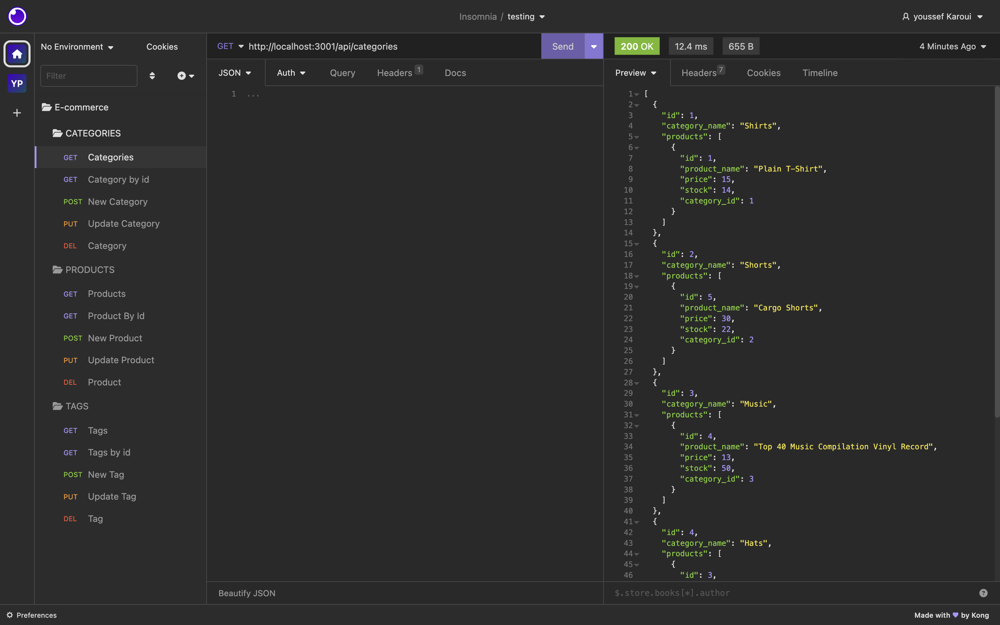

# E-commerce
   

  This is a back end E-commerce  application that's going to help  business owners introduce a booming new technology "E-commerce" to their busnisses  so they can compete with big companies.
 
  

  ## Table of Contents

  - [Installation](#installation)
  - [Usage](#usage)
  - [Contribution](#contribution)
  - [Demonstration](#demonstration)
  - [Testing](#testing)
  - [Credits](#credits)
  - [License](#license)
  - [Questions](#questions)

  
  ## Installation

  fork the code into you local machine , then run npm install. After installing all your dependencies, you then run your database by running 'mysql -u root -p', enter your credentials  and source your db. You then run 'npm run seed' yo seed the db . Finally run 'npm start' to start your server.

  

  ## Usage

  Open Insomnia and start testing your routes.
  

  ## Contribution 

  Please create an issue  before making any merges..

  
  
  ## Demonstration

  [Watch this video demonstration](https://drive.google.com/file/d/15sFVK5YQ0b8d8lz_1mNz-tQ_1UnLX3rI/view?usp=sharing)

  

  ## Credits

Starter Code for this application was provided by the GW Fullstack Web Development Bootcamp.

  

  ## Testing 

  Run the tests on Insomnia to check if all the routes are working.

  

  ## License 

     Copyright 2023 Youssef Karoui    Permission is hereby granted, free of charge, to any person obtaining a copy of this software and associated documentation files (the “Software”), to deal in the Software without restriction, including without limitation the rights to use, copy, modify, merge, publish, distribute, sublicense, and/or sell copies of the Software, and to permit persons to whom the Software is furnished to do so, subject to the following conditions: The above copyright notice and this permission notice shall be included in all copies or substantial portions of the Software.

  If you would like to know more about licensing information here's a link for more details: https://opensource.org/license/mit/

  

  ## Questions 

  [Email me if you have any questions](mailto:youssefkaroui6@gmail.com)

[Review my other projects on GitHub.](https://www.github.com/youssefkaroui)

  